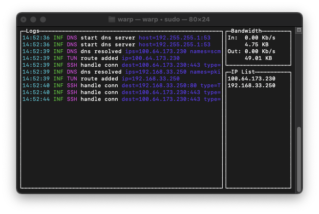

# WARP

WARP is a tool designed to forward TCP traffic through an SSH tunnel. It provides a secure and efficient way to route your network data.

## Table of Contents

- [WARP](#warp)
  - [Table of Contents](#table-of-contents)
  - [Installation](#installation)
  - [Usage](#usage)
    - [Command Line Options](#command-line-options)
  - [Examples](#examples)
  - [License](#license)

## Installation

To install WARP, you need to clone the repository and then build the project using `make`.

```bash
git clone https://github.com/merzzzl/warp.git
cd warp
make build
```

## Usage

To run WARP, execute the following command with the appropriate options:

```bash
./warp [options]
```

### Command Line Options

Here are the available command line options:

- `-ssh`: Specifies the SSH host to connect to. Default is `root@127.0.0.1`.
- `-tun`: Specifies the name of the utun device. Default is `utun5`.
- `-ip`: Specifies the IP address for the utun device. Default is `192.168.48.1`.
- `-domain`: Specifies the domain suffix for routing. Default is `.`.
- `-tui`: Enables Text-based User Interface (TUI) mode. Disabled by default.

## Examples

Here's an example of how to forward TCP traffic through an SSH tunnel on localhost:

```bash
./warp -ssh root@127.0.0.1 -tun utun5 -ip 192.168.48.1 -domain . -tui
```



## License

This project is licensed under the MIT License.
